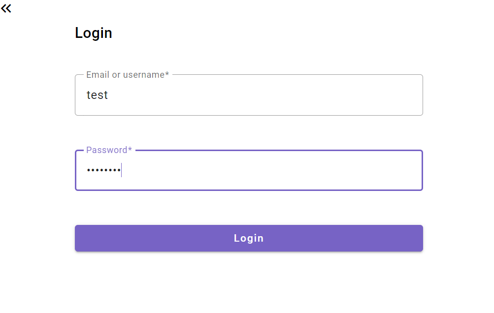

# MDD
## Table of contents

- Description and goals
- App features
- Installation
- Database setup
- Run application
- Swagger (OpenAPI)
- Technologies
- Compodoc
- Screenshots

## Description and goal

MDD (Monde de Dév) is a social network project dedicated to developers:
Project developed as part of the development of a project for my master's degree.
 This repository contains both the frontend and backend code for a Minimum Viable Product version.

## App features

### User management
- User registration
- Profile management
- User session
- Logout

### Topic management
- List all topics
- Subscribe to topic
- Unsubscribe from topic

### Post management
- View feed with sort by date or by title
- Create post
- Read post details
- Comment post


## Installation

### Clone the Project

Clone these repositories :
> git clone https://github.com/popcodelab/MDD_MVP

### Install Dependencies

#### Back-End:

> mvn clean install

#### Front-End:

> npm install

### Configuring the Back-End

Open the `application.properties` file located in the `back/src/main/resources` directory to Replace the properties with your parameters:

```properties
spring.datasource.url=${APP_DB_URL}
spring.datasource.username=${APP_DB_USERNAME}
spring.datasource.password=${APP_DB_PASSWORD}
```

## Database setup 

Make sure that you have MySQL installed on your system.

1. Log into MySQL using the following command :
> mysql -u `<username>` -p

2. Create the database :

> CREATE DATABASE `<database_name>`;

3. Select the created database :
> USE `<database_name>`;


### Build the database

Use the SQL script located in `ressources\sql\creates_db.sql`  to create the schema :

> SOURCE `<path_to_script.sql>`;
     

## Run application

1. Frontend
   
   - In your terminal, run the command below.
    
        ```bash
        cd front
        npm run start
        ```

     The frontend will launch in your browser at `http://localhost:4400`
  
2. Backend

     - In a separate terminal, run the command below.

          ```bash
          cd back
          mvn spring-boot:run
          ```

        The backend server will launch at `http://localhost:3005`

---

## Swagger documentation

Once the backend started, the documentation can be browsed at : http://localhost:3005/swagger-ui/index.html

Use the authentication endpoint to get a JWT token to access to the protected routes.


## Technologies

<table style="border: none">
<tr style="border: none">
  <td style="border: none">HTML5</td><td style="border: none">
  </td>
</tr>
<tr style="border: none">
  <td style="border: none">TypeScript 5.4.3</td><td style="border: none">
  </td>
</tr>
<tr style="border: none">
  <td style="border: none">JavaScript</td><td style="border: none">
  </td>
</tr>
<tr style="border: none">
  <td style="border: none">CSS3</td><td style="border: none">
  </td>
</tr>

<tr style="border: none"> 
  <td style="border: none">Angular 17.3.8</td>
  <td style="border: none"></td>
</tr>

<tr style="border: none">  
  <td style="border: none">Compodoc 1.1.25</td>
  <td style="border: none"></td>
</tr>
<tr style="border: none"> 
  <td style="border: none">Angular Material 17.3.0</td>
  <td style="border: none"></td>
</tr>
<tr style="border: none"> 
  <td style="border: none">MySQL 8</td>
  <td style="border: none"></td>
</tr>
<tr style="border: none"> 
  <td style="border: none">Java 17</td>
  <td style="border: none"></td>
</tr>
<tr style="border: none"> 
  <td style="border: none">Spring Boot 3.3.0</td>
  <td style="border: none"></td>
</tr>
</table>


## Compodoc

To generate the documentation, if compodoc is not installed, follow the instructions bellow :

instal compodoc : `npm install @compodoc/compodoc`

Once installed :
- To generate the documentation run the command : `npm run compodoc`
- To Serve it on http://127.0.0.1:8080  : `npm run compodoc:serve`


## Authors

POP's Code Lab

## Screenshots
 


---
Front-end :  


Back-end :  


<br>
<hr>

 <div align="center">

 [](https://forthebadge.com)
 [](https://forthebadge.com)
 [](https://forthebadge.com)
 [](https://forthebadge.com)

</div>
<hr/>

